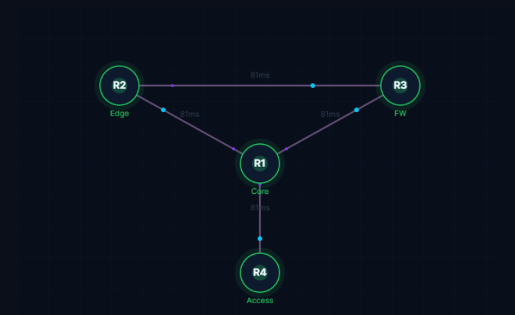
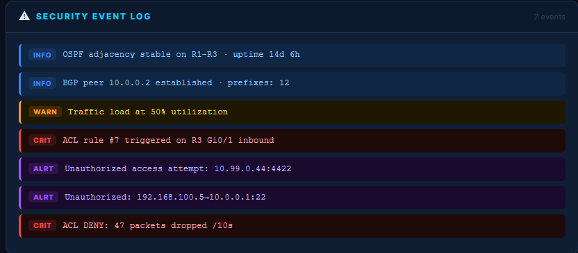
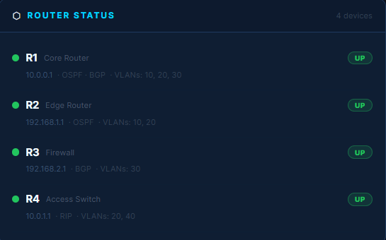
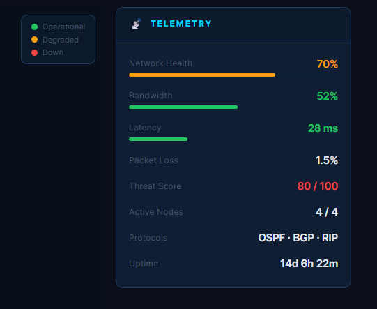
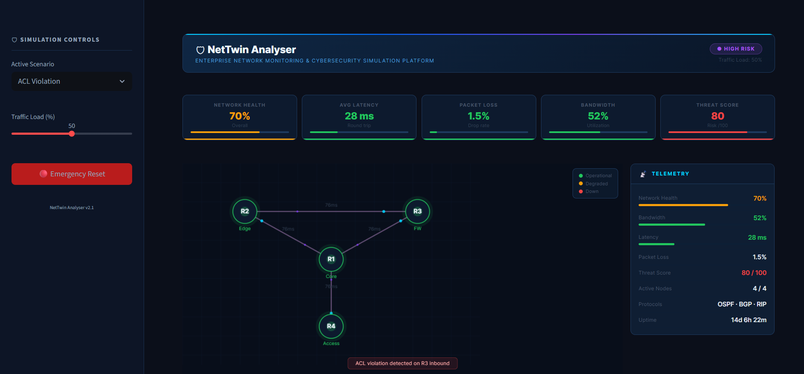

# NetTwin Analyser

> Enterprise-grade cybersecurity monitoring and network digital twin platform with interactive SOC dashboard, attack simulation, telemetry analytics, and infrastructure visualization.

[](https://www.python.org/)
[](https://streamlit.io/)
[](https://pyvis.readthedocs.io/)
[](https://plotly.com/)
[](https://networkx.org/)
[](https://owasp.org/)
[](LICENSE)

---

# Overview

NetTwin Analyser is an enterprise-style cybersecurity monitoring and network simulation platform built using Python, Streamlit, PyVis, Plotly, and NetworkX.

The project transforms raw network configuration files into a live digital twin capable of:

- topology reconstruction
- outage simulation
- traffic monitoring
- routing protocol analysis
- ACL/firewall validation
- attack simulation
- telemetry visualization
- security event monitoring

The platform includes a modern cyberpunk-inspired SOC/NOC dashboard that provides interactive topology visualization, telemetry analytics, security event feeds, router monitoring, and infrastructure threat simulation.

Designed for:
- SOC analysts
- network engineers
- cybersecurity students
- infrastructure automation teams
- security operations workflows

---

# Dashboard Preview

## Enterprise SOC Dashboard


---

# Screenshots

## Interactive Network Topology



---

## Security Event Monitoring



---

## Router Status Panel



---

## Telemetry & Threat Analytics



---

## ACL Violation Simulation



---

## Backend CLI Analysis Engine


---

# Key Features

## Network Monitoring

- Interactive enterprise topology visualization
- Dynamic traffic monitoring
- Real-time telemetry analytics
- Infrastructure health scoring
- Packet loss and latency analysis
- Router/device operational monitoring

---

## Cybersecurity Simulation

- ACL violation simulation
- DDoS attack simulation
- Routing instability analysis
- VLAN mismatch detection
- Threat telemetry scoring
- Security event classification
- Attack impact simulation

---

## Infrastructure Analysis

- Topology reconstruction from configuration files
- Routing protocol awareness (OSPF/BGP/RIP)
- Link failure simulation
- Traffic anomaly detection
- Network outage analysis
- Infrastructure dependency mapping

---

## Dashboard Capabilities

- Streamlit-powered enterprise dashboard
- PyVis interactive topology engine
- Plotly telemetry visualization
- Cyberpunk SOC/NOC UI
- Real-time alert simulation
- Security event logging
- Interactive simulation controls

---

# Architecture Overview

```text
Sample Configurations
        ↓
Configuration Parser
        ↓
Topology Reconstruction Engine
        ↓
Traffic Analysis Engine
        ↓
Simulation Engine
        ├── Link Failure Simulation
        ├── Attack Simulation
        ├── ACL Validation
        └── Routing Analysis
        ↓
Security Monitoring
        ↓
Telemetry Dashboard
        ↓
Interactive SOC Visualization
```

---

# Project Structure

```text
NetTwin-Analyser/
│
├── analyzer/
├── api/
├── dashboard/
│   ├── app.py
│   ├── components/
│   ├── styles/
│   └── assets/
│
├── logs/
├── monitoring/
├── parser/
├── recommender/
├── sample_configs/
├── screenshots/
├── security/
├── simulator/
├── topology/
├── utils/
│
├── main.py
├── requirements.txt
├── README.md
└── LICENSE
```

---

# Technologies Used

| Technology | Purpose |
|---|---|
| Python | Core backend and simulation engine |
| Streamlit | Interactive enterprise dashboard |
| PyVis | Interactive topology visualization |
| Plotly | Telemetry analytics and metrics |
| NetworkX | Graph-based topology modeling |
| Matplotlib | Backend visualization support |
| HTML/CSS | Custom cyberpunk UI styling |
| Graph Theory | Path and outage analysis |
| CLI Automation | Infrastructure workflow execution |

---

# Installation

## Clone Repository

```bash
git clone https://github.com/RewaS10/NetTwin-Analyser.git
```

## Navigate Into Project

```bash
cd NetTwin-Analyser
```

## Install Dependencies

```bash
pip install -r requirements.txt
```

---

# Running The Project

# 1. Launch Enterprise Dashboard

```bash
streamlit run dashboard/app.py
```

This launches:
- SOC dashboard
- topology visualization
- telemetry monitoring
- security event feed
- attack simulation controls

---

# 2. Run CLI Analysis Engine

```bash
python main.py --input sample_configs --analyze --simulate --node1 R1 --node2 R2 --visualize --logs --acl --attack --routing
```

This runs:
- topology analysis
- outage simulation
- traffic analysis
- ACL validation
- attack simulation
- routing analysis
- security log analysis

---

# Dashboard Capabilities

## Interactive Topology

- Drag-and-drop network graph
- Dynamic link states
- Traffic visualization
- Device status monitoring
- Interactive node inspection

---

## Telemetry Monitoring

- Network health score
- Threat analytics
- Packet loss monitoring
- Bandwidth utilization
- Latency tracking
- Uptime analysis

---

## Security Operations

- Security event logging
- ACL violation alerts
- Threat scoring
- Attack simulation
- Operational alerts
- Infrastructure risk analysis

---

# Example CLI Output

## Topology Analysis

```text
=== TOPOLOGY ===
Nodes: 16
Edges: 20
Topology Status: Stable
Traffic Utilization: 82%
```

---

## Attack Simulation

```text
=== ATTACK SIMULATION ===
Threat vector detected on R1-R2
Affected devices: R2, R3, FW1
Recommended action:
- isolate affected segment
- validate ACL policies
- reroute traffic
```

---

## ACL Simulation

```text
=== ACL SIMULATION ===
Denied flows: 7
Allowed flows: 29
Conflicting rules: 0
```

---

## Routing Analysis

```text
=== ROUTING PROTOCOL ANALYSIS ===
OSPF adjacency stable
BGP peer matrix healthy
Route convergence: 3.2 seconds
```

---

# Future Improvements

- Live websocket telemetry streaming
- Threat intelligence feed integration
- Real-time packet capture analysis
- SIEM integration
- Authentication and RBAC
- Multi-tenant SOC monitoring
- AI-driven anomaly detection
- Cloud deployment scaling

---

# Resume Impact

This project demonstrates practical skills in:

- cybersecurity monitoring
- SOC/NOC dashboard development
- enterprise networking
- infrastructure visualization
- attack simulation
- routing analysis
- Python backend engineering
- topology modeling
- telemetry analytics
- infrastructure automation

---

# Deployment

The dashboard is fully deployable using:

- Streamlit Cloud
- Render
- Docker
- VPS hosting

---

# Contribution

Contributions are welcome.

To contribute:

```bash
git checkout -b feature/your-feature
```

Then:
- commit changes
- push branch
- open pull request

---

# Author

Developed by Rewa

Cybersecurity • Network Monitoring • Infrastructure Simulation

---

# License

MIT License

Copyright (c) 2026 NetTwin Analyser

Permission is hereby granted, free of charge, to any person obtaining a copy
of this software and associated documentation files to deal in the Software
without restriction.

---

Built for enterprise cybersecurity monitoring, infrastructure simulation, and SOC visualization.