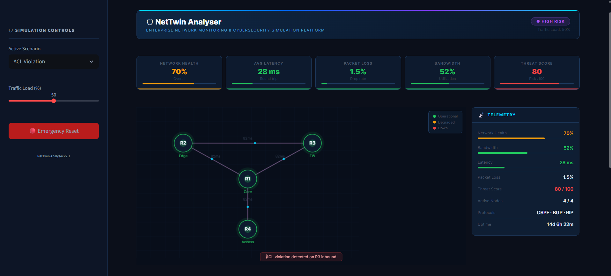
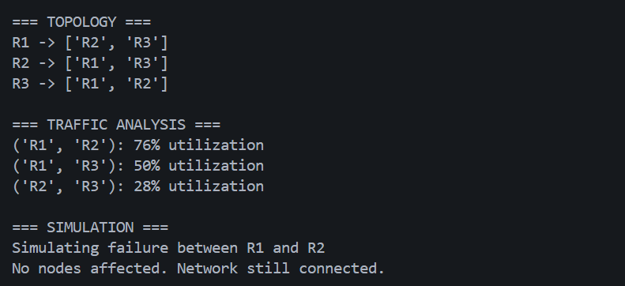
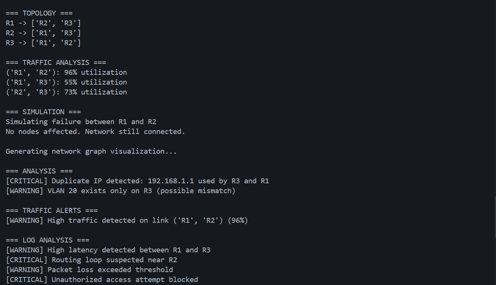
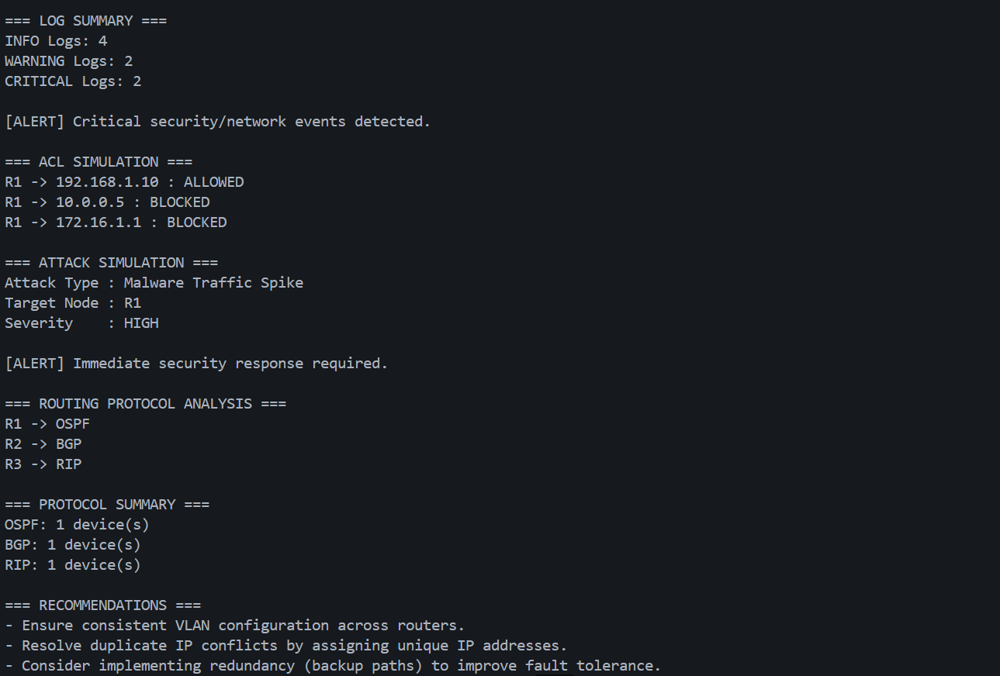

# NetTwin Analyser
> Built as an advanced cybersecurity and enterprise network monitoring project for topology analysis, outage simulation, traffic monitoring, and security event analysis.

[](https://www.python.org/) [](https://networkx.org/) [](https://matplotlib.org/) [](https://docs.python.org/3/library/argparse.html) [](https://owasp.org/) [](LICENSE)

## Project Description

NetTwin Analyser is a Python-based enterprise-grade platform that builds a digital twin of infrastructure networks from raw configuration files. It reconstructs topology, synthesizes traffic behavior, simulates outages, and validates security posture through log analysis, ACL policy emulation, attack modeling, and routing deployment review.

This tool is designed for security analysts, network engineers, and operations teams that require a unified environment for topology discovery, threat validation, outage simulation, and routing protocol assessment.
## Table of Contents

- Features
- Architecture Overview
- Project Structure
- Screenshots
- Technologies Used
- Installation
- Usage
- Example Output
- Network Dashboard
- Security Capabilities
- Future Improvements
- Resume Impact
- Contribution
- License

## Key Features

- **Enterprise topology reconstruction** from multi-device configuration input  
- **Traffic utilization analysis** with anomaly alerting  
- **Network outage simulation** via targeted link failure  
- **Network health metrics dashboard** with graph-based analytics  
- **Security log analysis** for event extraction and incident detection  
- **ACL/firewall simulation** for rule verification and policy validation  
- **Cyber attack simulation** to model threat scenarios and impact  
- **Routing protocol awareness** for protocol deployment and path validation  
- **CLI-driven monitoring workflow** for automation and operational testing  
- **Graph-based visualization** of network state, traffic flows, and failure domains  

## Architecture Overview

```text
Sample Configs
      ↓
Config Parser
      ↓
Topology Builder
      ↓
Traffic Analyzer
      ↓
Simulation Engine
      ↓
Security Modules
      ├── ACL Engine
      ├── Attack Simulator
      └── Log Analyzer
      ↓
Routing Analysis
      ↓
Visualization Dashboard
```

## Project Structure

```text
NetTwin-Analyser/
├── analyzer/
├── logs/
├── monitoring/
├── parser/
├── recommender/
├── sample_configs/
├── security/
├── simulator/
├── topology/
├── utils/
├── main.py
├── requirements.txt
├── README.md
└── LICENSE
```
## Demo Workflow

```bash
python main.py --input sample_configs --analyze --simulate --node1 R1 --node2 R2 --visualize --logs --acl --attack --routing
## Screenshots

### Architecture Diagram


### Monitoring Dashboard


### Failure Simulation


### Monitoring and Analysis Output


### Security Simulation Output


## Technologies Used

| Technology | Purpose |
| --- | --- |
| Python | Core automation and analysis engine |
| NetworkX | Graph-based topology and path analysis |
| Matplotlib | Visualization and network plotting |
| argparse | CLI workflow and operational control |
| Graph Theory | Topology modeling and failure simulation |
| CLI Simulation | Automated infrastructure scenario execution |

## Installation Instructions

```bash
git clone https://github.com/RewaS10/NetTwin-Analyser.git
cd NetTwin-Analyser
pip install -r requirements.txt
```

## Usage Instructions

Run the platform with a full monitoring and simulation workflow:

```bash
python main.py --input sample_configs --analyze --simulate --node1 R1 --node2 R2 --visualize --logs --acl --attack --routing
```

### CLI Flags

| Flag | Description |
| --- | --- |
| `--input` | Path to the configuration folder containing device files |
| `--analyze` | Run configuration analysis and detect issues |
| `--simulate` | Simulate a link failure scenario |
| `--node1` | First endpoint for outage simulation |
| `--node2` | Second endpoint for outage simulation |
| `--visualize` | Render topology and traffic visualization |
| `--logs` | Analyze network event logs |
| `--acl` | Execute ACL/firewall policy simulation |
| `--attack` | Simulate attack scenarios against the topology |
| `--routing` | Analyze routing protocol deployment and consistency |

## Example Output

### Topology Analysis

```text
=== TOPOLOGY ===
Nodes: 16
Edges: 20
Topology status: stable
Traffic summary: 82% capacity utilization
```

### Attack Simulation

```text
=== ATTACK SIMULATION ===
Threat vector identified on link R1-R2
Compromised segment: R2, R3, FW1
Recommendation: isolate affected path and validate edge ACL rules
```

### ACL Simulation

```text
=== ACL SIMULATION ===
Policy validation completed
Denied flows: 7
Allowed flows: 29
Conflicting rules: 0
```

### Routing Protocol Analysis

```text
=== ROUTING PROTOCOLS ===
OSPF adjacency validation passed
BGP peer matrix stable
Route convergence: 3.2 seconds
```

## Network Dashboard Explanation

The visualization dashboard is designed for rapid operational insight:

- **Node colors** indicate traffic load, device health, and active reachability  
- **Failed links** show outage impact zones and path degradation  
- **Traffic labels** annotate bandwidth utilization and flow intensity  
- **Metrics panel** summarizes health indicators, packet loss, and latency trends  
- **Health score** reflects combined topology integrity, traffic stability, and security posture  

## Security Capabilities

NetTwin Analyser delivers enterprise-focused security validation through:

- **Attack detection** for simulated threat activity and infrastructure compromise  
- **Access control simulation** to validate ACL and firewall rule behavior under real network state  
- **Anomaly monitoring** for traffic deviations and suspicious patterns  
- **Security event analysis** from log data to identify operational incidents  
- **Threat simulation** for resilience validation and policy tuning  

## Future Improvements

- Streamlit dashboard for interactive enterprise monitoring  
- Real-time packet capture and packet-level visibility  
- SIEM integration for centralized security event correlation  
- Live monitoring with continuous network state updates  
- SNMP support for device polling and telemetry intake  
- AI anomaly detection for advanced threat and traffic behavior modeling  
- Multi-device simulation for large-scale infrastructure validation  

## ## Skills Demonstrated
- enterprise networking architecture  
- cybersecurity simulation and threat modeling  
- monitoring automation with Python  
- graph-based infrastructure analysis  
- infrastructure resilience and outage testing  
- CLI-driven operational workflows  

## Contribution

Contributions are welcome from security engineers, network architects, and automation developers. To contribute:

1. Fork the repository.  
2. Create a feature branch: `git checkout -b feature/your-change`.  
3. Submit a pull request with detailed test steps.

Please follow clean code standards, include documentation for new features, and provide validation cases for any simulation or analysis updates.

## License

MIT License

Copyright (c) 2026 NetTwin Analyser

Permission is hereby granted, free of charge, to any person obtaining a copy
of this software and associated documentation files (the "Software"), to deal
in the Software without restriction, including without limitation the rights
to use, copy, modify, merge, publish, distribute, sublicense, and/or sell
copies of the Software, and to permit persons to whom the Software is
furnished to do so, subject to the following conditions:

The above copyright notice and this permission notice shall be included in all
copies or substantial portions of the Software.

THE SOFTWARE IS PROVIDED "AS IS", WITHOUT WARRANTY OF ANY KIND, EXPRESS OR
IMPLIED, INCLUDING BUT NOT LIMITED TO THE WARRANTIES OF MERCHANTABILITY,
FITNESS FOR A PARTICULAR PURPOSE AND NONINFRINGEMENT. IN NO EVENT SHALL THE
AUTHORS OR COPYRIGHT HOLDERS BE LIABLE FOR ANY CLAIM, DAMAGES OR OTHER
LIABILITY, WHETHER IN AN ACTION OF CONTRACT, TORT OR OTHERWISE, ARISING FROM,
OUT OF OR IN CONNECTION WITH THE SOFTWARE OR THE USE OR OTHER DEALINGS IN THE
SOFTWARE.

---

Built for enterprise network monitoring, cybersecurity simulation, and infrastructure analysis.